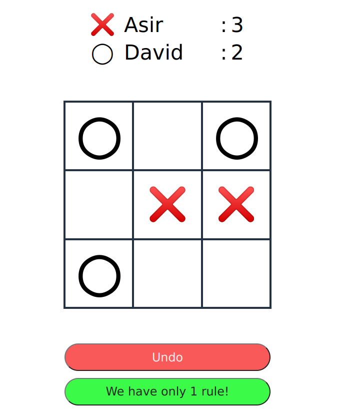
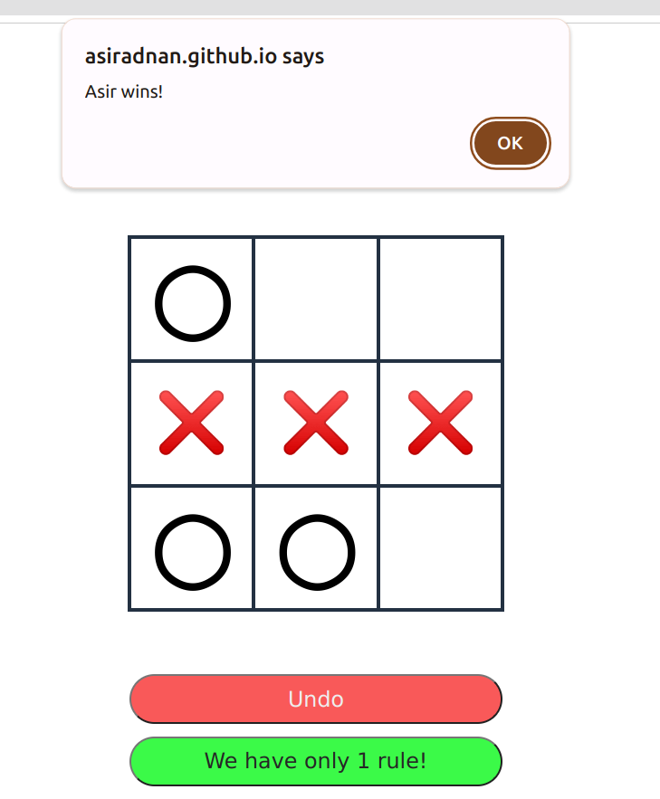

# Tic-Tac-Toe!

A classic Tic-Tac-Toe game implemented using HTML, CSS, and JavaScript. 

## Features

- Change your names
- Track your scores
- Undo only YOUR last move
- First move is toggled after every round. 

## Demo

Check out the live demo [here](https://asiradnan.github.io/Tic-Tac-Toe/)!

## Screenshots

### Gameplay

### Result

