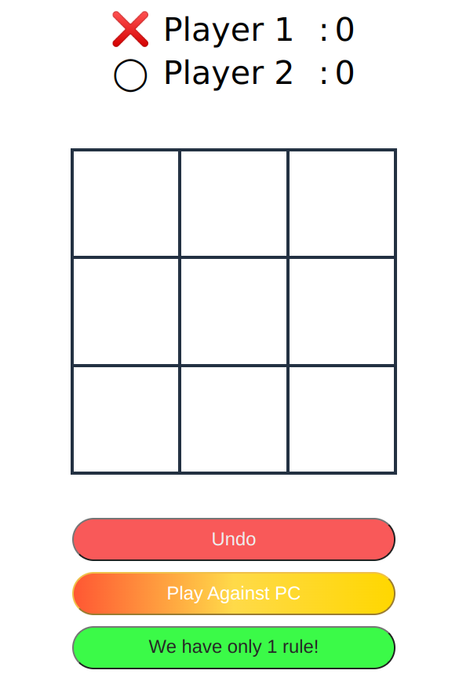
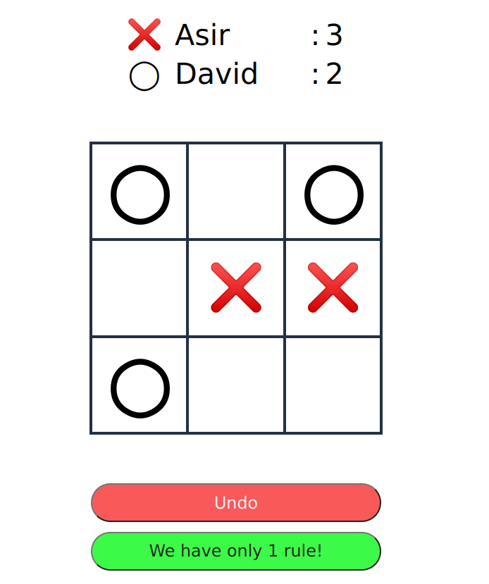
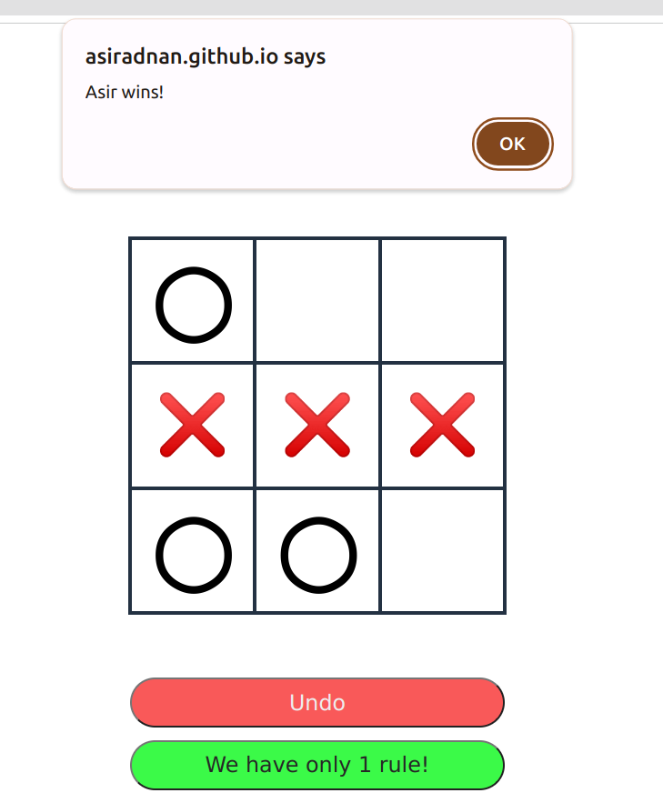

#  Tic-Tac-Toe

A classic Tic-Tac-Toe web application built using HTML, CSS, and JavaScript. Play against a friend or challenge a smart computer opponent. Additional features include persistent score tracking, undo functionality, and automatic win detection.

> This was one of the early projects I built to learn and practice JavaScript and CSS.

## Live Link

Play Tic-Tac-Toe: [https://tictactoe.asiradnan.com](https://tictactoe.asiradnan.com)

## Features

- **Game Modes:** Play locally with a friend or challenge a smart computer AI.
- **Score Tracking:** Keep track of player wins across multiple games.
- **Undo Moves:** Undo your last move in two-player mode to correct mistakes.
- **Move Confirmation:** Confirm your move before the Computer plays to prevent accidental clicks.
- **Fair Play Rotation:** Automatically alternate the starting player after each completed game.
- **Win Detection:** Automatically detect winning combinations and draw scenarios.
- **Custom Names:** Change player names easily through an interactive prompt.
- **Responsive Design:** Play on various devices with a clean, intuitive layout.

## Demo and Screenshots 
<video src="./screenshots/TicTacToe Demo.mp4" controls width="300"></video>

## License
This project is open source under the **MIT License**.

